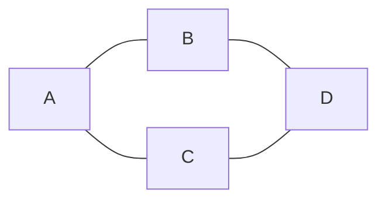

# What Is a Graph

A graph is **a set of things, plus a set of connections between those things.**

That's it. Two sets.

```
G = (V, E)

V = vertices  (the things)
E = edges     (the connections)
```

The "things" can be anything: cities, people, web pages, course prerequisites, cells
in a grid, states of a Rubik's cube, words in a dictionary. The moment you have
*things* and *relationships between them*, you have a graph.



```
V = {A, B, C, D}
E = {(A,B), (A,C), (B,D), (C,D)}
```

---

## Why this matters in an interview

Most graph interview questions never say the word "graph". They say "cities and
flights", "courses and prerequisites", "a 2D grid", "transform one word into another".

Your first job is always the same: **name the vertices, name the edges.** Say it out loud:

> "Let me model this. Each course is a vertex, and a prerequisite `a → b` is a directed
> edge from `a` to `b`."

If you can do that reliably, you're halfway to the solution. If you can't, no amount of
algorithm memorization saves you.

This is doubly true for [[12 Implicit Graphs|Implicit Graphs]], where nobody hands you a vertex list at all
— you have to invent it.

---

## The four questions to ask about any graph

Before writing a single line, answer these. Each one eliminates half the algorithms.

1. **[[03 Directed vs Undirected|Directed vs Undirected]]?** → decides your adjacency-building code and your cycle detector
2. **[[04 Weighted vs Unweighted|Weighted vs Unweighted]]?** → decides BFS vs Dijkstra vs Bellman-Ford
3. **Can it have cycles?** → see [[06 Cyclic vs Acyclic and DAGs|Cyclic vs Acyclic and DAGs]]; a DAG unlocks topological sort
4. **Is it guaranteed connected?** → see [[07 Connectivity and Components|Connectivity and Components]]; if not, you need an outer loop

---

⬆️ [[00 Vocabulary Index|Tier 0 - Vocabulary]] · ➡️ [[02 Vertex and Edge|Vertex and Edge]]
