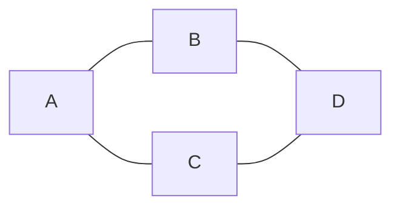

# Vertex and Edge

The words that surround the two core objects.

| Term | Meaning |
|---|---|
| **Node** / **Vertex** | One of the "things". Same word, used interchangeably. |
| **Edge** / **arc** | One connection between two vertices. "Arc" usually implies directed. |
| **Endpoints** | The two vertices an edge connects. |
| **Incident** | An edge is *incident to* its endpoints. Edge `(A,B)` is incident to `A` and to `B`. |
| **Adjacent** / **neighbor** | Two vertices are adjacent if an edge connects them. |
| **`V` or `n`** | The **number** of vertices. (Yes, `V` gets used for both the set and its size. Context tells you which.) |
| **`E` or `m`** | The **number** of edges. |

In the graph above: `A` and `B` are **adjacent**. `A` and `D` are **not** — no edge
directly joins them (though a [[05 Paths Walks and Cycles|path]] exists between them).
Edge `(A,B)` is **incident** to both `A` and `B`.

---

## Notation

You'll see complexity written both ways:

- `O(V + E)` — common in textbooks and interviews
- `O(n + m)` — common in competitive programming

They mean the same thing. Use whichever your interviewer uses.

> **Small habit that reads well:** when you state complexity, say what `V` and `E`
> actually are for *this* problem. "`O(V + E)` where `V` is the number of courses and
> `E` is the number of prerequisite pairs." For a grid, `V = R·C` and `E ≈ 4·R·C`, so
> the whole thing collapses to `O(R·C)`.

---

## Related

- [[08 Degree|Degree]] — counting the edges incident to a vertex
- [[11 Dense vs Sparse|Dense vs Sparse]] — how `E` relates to `V`, and why it decides your data structure

---

⬆️ [[00 Vocabulary Index|Tier 0 - Vocabulary]] · ⬅️ [[01 What Is a Graph|What Is a Graph]] · ➡️ [[03 Directed vs Undirected|Directed vs Undirected]]
