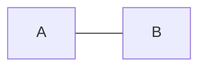
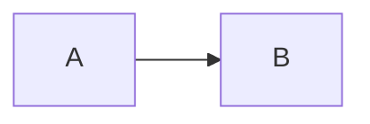

# Directed vs Undirected

The single most important distinction in graphs. It changes which algorithms are even legal.

---

## Undirected — the relationship goes both ways



If `A` connects to `B`, then `B` connects to `A`. Always. Automatically.

**Think:** friendship on Facebook, roads with two-way traffic, "these two accounts belong
to the same person", physical wires.

---

## Directed — the relationship has a direction



`A` points to `B`. `B` does **not** point back to `A` unless there's a separate edge `B → A`.

**Think:** Twitter follows, one-way streets, course prerequisites, web page links,
"task A must finish before task B".

---

## The code difference is one line

This is the #1 place people lose time or silently produce a wrong answer:

```python
from collections import defaultdict

# UNDIRECTED — add both directions
adj = defaultdict(list)
for u, v in edges:
    adj[u].append(v)
    adj[v].append(u)     # <-- this line

# DIRECTED — add one direction only
adj = defaultdict(list)
for u, v in edges:
    adj[u].append(v)
    # no reverse edge
```

**Forget the reverse edge on an undirected graph and your BFS will just... not find
things.** No crash, no error, just a wrong answer.

Get in the habit of stating out loud *"this is undirected, so I add both directions"*
as you type it. It costs one second and catches the bug before it exists.

---

## Consequences to internalize

| | Undirected | Directed |
|---|---|---|
| Max edges (simple graph) | `V(V-1)/2` | `V(V-1)` |
| Cycle detection algorithm | DFS w/ parent tracking, or Union-Find | 3-color DFS (white/gray/black) |
| "Connected" means | one notion | **two** notions (strong vs weak) |
| Topological sort | meaningless | the whole point |
| Union-Find applies | yes, naturally | usually not |

Note the cycle-detection row. **Undirected and directed cycle detection are different
algorithms.** People memorize one and try to use it for the other — see
[[06 Cyclic vs Acyclic and DAGs|Cyclic vs Acyclic and DAGs]] for exactly why they can't be interchanged.

The "connected" row matters too: directed graphs split into *strongly* and *weakly*
connected. See [[07 Connectivity and Components|Connectivity and Components]].

---

## Related

- [[06 Cyclic vs Acyclic and DAGs|Cyclic vs Acyclic and DAGs]] — why the parent trick works undirected but not directed
- [[07 Connectivity and Components|Connectivity and Components]] — strong vs weak connectivity
- [[08 Degree|Degree]] — direction splits degree into in-degree and out-degree
- [[11 Dense vs Sparse|Dense vs Sparse]] — the max-edge formulas above

---

⬆️ [[00 Vocabulary Index|Tier 0 - Vocabulary]] · ⬅️ [[02 Vertex and Edge|Vertex and Edge]] · ➡️ [[04 Weighted vs Unweighted|Weighted vs Unweighted]]
