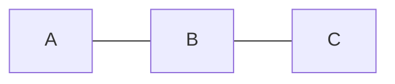
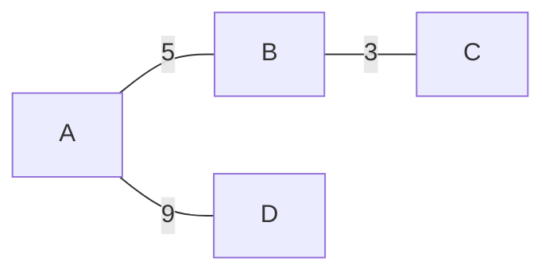

# Weighted vs Unweighted

This is the fork in the road for every shortest-path problem.

---

## Unweighted — every edge costs the same

Going `A → B → C` costs 2 "steps". Every edge is worth 1.

---

## Weighted — each edge carries a number

Going `A → B → C` costs `5 + 3 = 8`.

The weight can mean cost, distance, time, capacity, probability, difficulty — whatever
the problem says.

---

## Why this decides your algorithm

| Graph | Shortest path algorithm | Complexity |
|---|---|---|
| **Unweighted** | **BFS** | `O(V + E)` |
| Weighted, non-negative | Dijkstra | `O((V+E) log V)` |
| Weighted, negatives allowed | Bellman-Ford | `O(V · E)` |
| Weighted, all pairs, tiny `V` | Floyd-Warshall | `O(V³)` |
| Weights only 0 and 1 | 0-1 BFS (deque) | `O(V + E)` |

**BFS finds the shortest path on an unweighted graph.** That is not obvious the first
time you hear it, and it is the single most useful fact in interview graph problems.
BFS explores in rings of increasing distance from the source, so the first time you
reach a vertex, you reached it by the fewest edges possible.

**BFS does NOT work on weighted graphs.** A path with 2 heavy edges can cost more than a
path with 5 light edges, and BFS has no way to know that. That's what Dijkstra is for.

---

## Traps

> **Uniform weights = unweighted.** A weight of `1` on every edge means the graph is
> *effectively* unweighted. Use BFS. Don't waste 5 minutes writing Dijkstra to get the
> same answer more slowly.

> **Grids can be either.** A grid where every move costs 1 is unweighted → BFS. A grid
> where moving to cell `(r,c)` costs `grid[r][c]` is weighted → Dijkstra. Read carefully.

> **The relax operation isn't always `+`.** Dijkstra generalizes to any operation that's
> monotonic. Max-probability paths multiply (and use a max-heap). Min-effort paths take
> `max(so_far, edge)` instead of summing. Same skeleton, different one line.

---

## Related

- [[05 Paths Walks and Cycles|Paths Walks and Cycles]] — why negative weights break the "shortest walk is a path" guarantee
- [[06 Cyclic vs Acyclic and DAGs|Cyclic vs Acyclic and DAGs]] — on a DAG, shortest *and* longest path are both easy
- [[09 Self-Loops and Multi-Edges|Self-Loops and Multi-Edges]] — parallel edges with different weights need `min()` when building

---

⬆️ [[00 Vocabulary Index|Tier 0 - Vocabulary]] · ⬅️ [[03 Directed vs Undirected|Directed vs Undirected]] · ➡️ [[05 Paths Walks and Cycles|Paths Walks and Cycles]]
