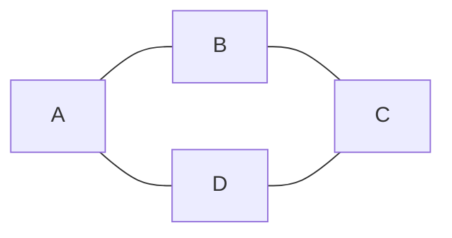

# Paths, Walks and Cycles

You'll see these used loosely, but the distinctions explain some algorithm behavior.

| Term | Rule | Example above |
|---|---|---|
| **Walk** | Any sequence of connected edges. Repeats allowed. | `A → B → A → B → C` |
| **Trail** | A walk with **no repeated edge**. | `A → B → C → D → A` |
| **Path** | A walk with **no repeated vertex**. (This is what people usually mean.) | `A → B → C` |
| **Cycle** | A path that starts and ends at the same vertex. | `A → B → C → D → A` |

---

## Path length counts EDGES, not vertices

`A → B → C` has length **2**, not 3.

Off-by-one errors in BFS distance almost always trace back to this. When you initialize
`dist[start] = 0`, you're saying "zero edges traveled" — not "one vertex visited".

---

## Why "shortest path" is usually safe to treat as "shortest walk"

When an interview says "shortest path", they mean a *path* — no repeated vertices.

Handily, on a graph with **non-negative** weights the shortest walk is automatically a
path: revisiting a vertex could only add cost, never save any. So you never have to
explicitly enforce "don't repeat vertices" — BFS and Dijkstra get it for free.

**This stops being true with negative weights.** If a cycle has negative total weight,
you can loop it forever and drive the cost to `-∞`. There is no shortest path.

That is exactly:
- why Dijkstra is *invalid* on graphs with negative edges,
- why Bellman-Ford runs one extra relaxation round — that round is a **negative-cycle detector**.

---

## Related

- [[06 Cyclic vs Acyclic and DAGs|Cyclic vs Acyclic and DAGs]] — cycles in detail, and the undirected 2-vertex trap
- [[04 Weighted vs Unweighted|Weighted vs Unweighted]] — which algorithm the weight sign forces you into
- [[10 Trees|Trees]] — in a tree there is **exactly one** path between any two vertices

---

⬆️ [[00 Vocabulary Index|Tier 0 - Vocabulary]] · ⬅️ [[04 Weighted vs Unweighted|Weighted vs Unweighted]] · ➡️ [[06 Cyclic vs Acyclic and DAGs|Cyclic vs Acyclic and DAGs]]
