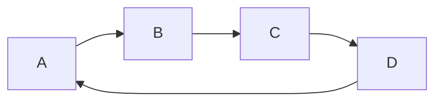
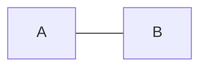
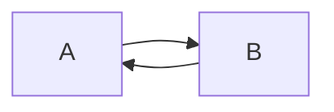
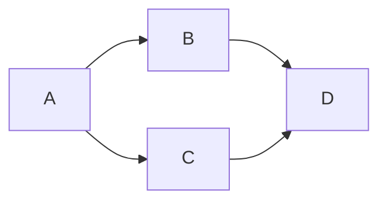

# Cyclic vs Acyclic and DAGs

---

## A cycle is a path that returns to where it started



`A → B → C → D → A` is a cycle.

A graph is **cyclic** if it contains at least one cycle, **acyclic** if it contains none.

---

## The 2-vertex trap in undirected graphs

Here is a subtlety that trips up nearly everyone.



Is `A → B → A` a cycle? **No.** You used the same edge twice. A cycle in an undirected
[[09 Self-Loops and Multi-Edges|simple graph]] needs **at least 3 distinct vertices**.

In a **directed** graph, `A → B → A` **is** a valid cycle — because it uses two distinct
edges (`A→B` and `B→A`):



### This is why the two cycle-detection algorithms differ

*The 2-vertex trap is the entire reason undirected cycle detection tracks the parent
vertex.* When DFS is at `B` and looks at neighbor `A`, it has to ask: "is `A` visited
because it's a genuine cycle, or just because `A` is the node I came from?" Skip the
parent, and you correctly ignore the false alarm.

```python
def has_cycle_undirected(node, parent, adj, visited):
    visited.add(node)
    for nei in adj[node]:
        if nei == parent:      # <-- came from here, not a cycle
            continue
        if nei in visited:     # visited by another route = real cycle
            return True
        if has_cycle_undirected(nei, node, adj, visited):
            return True
    return False
```

Directed cycle detection **can't** use that trick, because a 2-cycle is real. It uses the
three-color method (white / gray / black) instead — that's Tier 4.

> Memorize the rule, not the code: **undirected → track parent. directed → track
> recursion stack.** See [[03 Directed vs Undirected|Directed vs Undirected]].

---

## DAG — Directed Acyclic Graph

Say it out loud a few times: **D-A-G. Directed. Acyclic. Graph.**



No way to get back to where you started.

A DAG is the most important special structure in interview graphs:

- **A topological sort exists if and only if the graph is a DAG.** That's an *iff* — it
  goes both ways. If you can topologically sort it, it's acyclic. If it has a cycle,
  no valid ordering exists.
- Course prerequisites, build systems, task scheduling, package dependencies, spreadsheet
  formula evaluation — all DAGs.
- **Dynamic programming problems are DAGs in disguise.** The "subproblem depends on
  subproblem" relation is a DAG, and DP is just evaluating it in topological order.
- Longest path is NP-hard on general graphs but **easy on a DAG** (one topo-order pass).

Every DAG has at least one **source** ([[08 Degree|in-degree]] 0, nothing points to it) and
at least one **sink** (out-degree 0, points to nothing). Kahn's algorithm for topological
sort is literally: *repeatedly remove a source.*

> **Interview phrasing that means DAG:** "prerequisites", "dependencies", "build order",
> "can all tasks be completed", "is there a valid ordering". The moment you hear those,
> think topological sort — and remember that detecting a cycle is usually the *actual*
> question being asked ("return `false` if impossible").

---

## Related

- [[08 Degree|Degree]] — sources and sinks are just in-degree/out-degree 0
- [[10 Trees|Trees]] — a tree is the acyclic undirected case
- [[07 Connectivity and Components|Connectivity and Components]] — collapsing SCCs of any directed graph yields a DAG

---

⬆️ [[00 Vocabulary Index|Tier 0 - Vocabulary]] · ⬅️ [[05 Paths Walks and Cycles|Paths Walks and Cycles]] · ➡️ [[07 Connectivity and Components|Connectivity and Components]]
