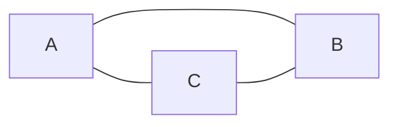
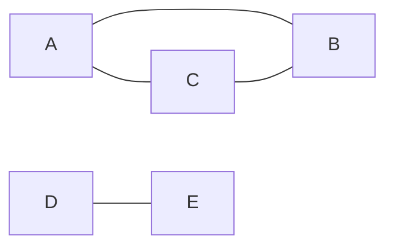
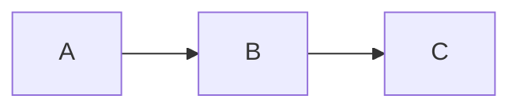
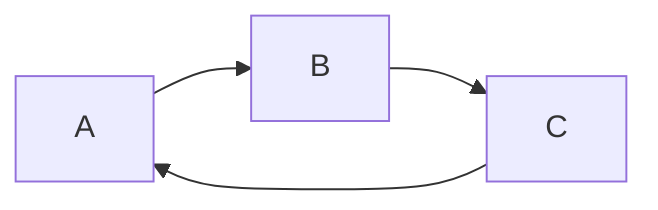

# Connectivity and Components

---

## Connected: can you get from anywhere to anywhere?

**Connected** — one piece:



**Disconnected** — two pieces, two components:



A **connected component** is one maximal "island" of the graph — a group where every
vertex can reach every other, and which can't be grown any bigger.

---

## The single most common bug in graph problems

```python
# WRONG — only explores the component containing vertex 0
visited = set()
dfs(0)

# RIGHT — every vertex gets a chance to start a new traversal
visited = set()
components = 0
for v in range(n):
    if v not in visited:
        dfs(v)
        components += 1
```

**Never assume the graph is connected unless the problem guarantees it.**

That outer loop is also, conveniently, how you *count* components — which is a whole
family of interview questions ("number of provinces", "number of islands", "number of
friend circles", "number of connected components").

> Say this in the interview: *"Is the graph guaranteed connected?"* If they say no —
> or if they hesitate — you write the outer loop.

---

## Directed graphs have TWO kinds of connected

Because [[03 Directed vs Undirected|direction]] matters, "can I get there" is no longer symmetric.



- **Weakly connected**: connected if you erase all the arrows and treat it as undirected.
  The graph above **is** weakly connected.
- **Strongly connected**: every vertex can reach every other vertex *following the arrows*.
  The graph above is **not** — you can't get from `C` back to `A`.

This one **is** strongly connected — everyone can reach everyone:



A **strongly connected component (SCC)** is a maximal group of vertices that can all
reach each other. Finding SCCs (Tarjan's or Kosaraju's) is Tier 9 — advanced, rarely
asked, but know the term so you're not blindsided.

> **Useful fact for later:** if you collapse every SCC into a single vertex, the resulting
> graph is always a [[06 Cyclic vs Acyclic and DAGs|DAG]]. That's called the **condensation**,
> and it's how you turn a messy cyclic directed graph into something you can
> topologically sort.

---

## Related

- [[10 Trees|Trees]] — a tree is connected + acyclic; a **forest** is a disconnected set of trees
- [[08 Degree|Degree]] — a vertex with degree 0 is an isolated one-vertex component
- [[06 Cyclic vs Acyclic and DAGs|Cyclic vs Acyclic and DAGs]] — the condensation link above

---

⬆️ [[00 Vocabulary Index|Tier 0 - Vocabulary]] · ⬅️ [[06 Cyclic vs Acyclic and DAGs|Cyclic vs Acyclic and DAGs]] · ➡️ [[08 Degree|Degree]]
