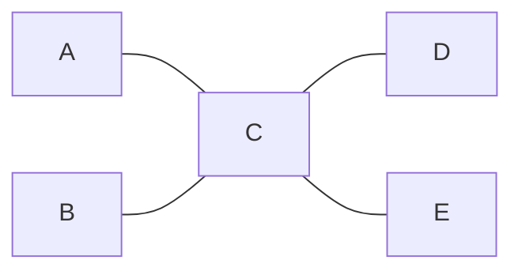
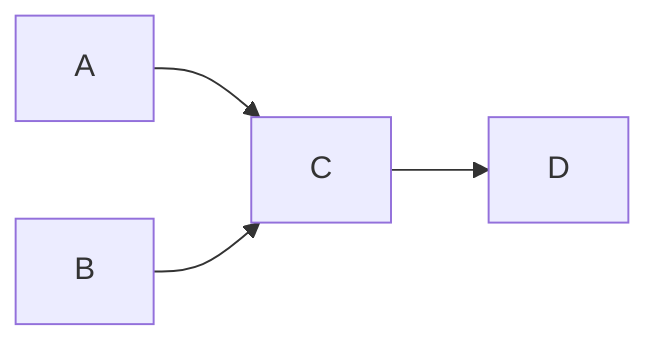

# Degree, In-Degree, Out-Degree

**Degree** = how many edges touch a vertex.



```
deg(C) = 4
deg(A) = deg(B) = deg(D) = deg(E) = 1
```

---

## For directed graphs it splits in two



```
in-degree(C)  = 2   (A and B point in)
out-degree(C) = 1   (points to D)
```

---

## The handshake lemma — a genuinely useful sanity check

**Undirected:** the sum of all degrees equals `2E`.

Every edge has two endpoints, so it gets counted twice. Simple, but it means: if your
degrees sum to an odd number, you built your graph wrong.

**Directed:** sum of in-degrees = sum of out-degrees = `E`.

---

## Where degree shows up in real problems

| Degree fact | What it unlocks |
|---|---|
| in-degree 0 | A **source**. Kahn's topological sort starts here. |
| out-degree 0 | A **sink**. Terminal state, "eventual safe node". |
| degree 1 (undirected) | A **leaf**. Peeling leaves = "minimum height trees". |
| degree 0 | Isolated vertex — its own [[07 Connectivity and Components\|component]]. |
| all degrees even | An **Eulerian circuit** exists (trace every edge once, return to start). |
| exactly 2 odd degrees | An **Eulerian path** exists (trace every edge once, different start/end). |

**Kahn's algorithm is really just "maintain in-degrees, repeatedly take anything at
zero".** Understanding in-degree makes topological sort feel obvious instead of
memorized — you're not learning a trick, you're peeling sources off a
[[06 Cyclic vs Acyclic and DAGs|DAG]].

The Eulerian rows are Tier 9, but notice they're pure degree facts. You can *check*
whether an Eulerian path exists in `O(V)` without running any traversal at all.

---

## Related

- [[06 Cyclic vs Acyclic and DAGs|Cyclic vs Acyclic and DAGs]] — sources and sinks, and why every DAG has both
- [[10 Trees|Trees]] — leaves are degree-1 vertices; every tree with ≥2 vertices has ≥2 leaves
- [[11 Dense vs Sparse|Dense vs Sparse]] — average degree is `2E/V` undirected

---

⬆️ [[00 Vocabulary Index|Tier 0 - Vocabulary]] · ⬅️ [[07 Connectivity and Components|Connectivity and Components]] · ➡️ [[09 Self-Loops and Multi-Edges|Self-Loops and Multi-Edges]]
