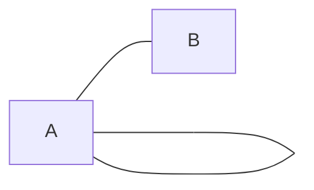
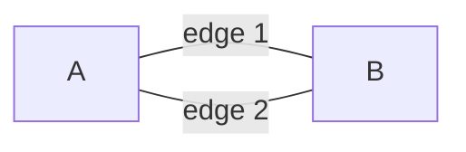

# Self-Loops and Multi-Edges

The edge cases that quietly break otherwise-working code.

**Self-loop** — an edge from a vertex to itself:



**Multi-edge** — two or more edges between the same pair:



---

| Term | Meaning |
|---|---|
| **Self-loop** | An edge from a vertex to itself: `(A, A)`. |
| **Multi-edge** / parallel edge | Two or more edges between the same pair. |
| **Simple graph** | No self-loops, no multi-edges. **Assume this by default.** |
| **Multigraph** | Multi-edges allowed. |

---

## Why you should still ask

Most interview problems are simple graphs and never mention it. But both cases quietly
break code:

- **A self-loop is trivially a cycle in a directed graph.** Your
  [[06 Cyclic vs Acyclic and DAGs|cycle detector]] must handle `adj[A]` containing `A`.
  A naive parent-tracking undirected detector will also mis-handle it.

- **Multi-edges break `set`-based adjacency.** `adj = defaultdict(set)` silently
  deduplicates — which is *wrong* if edge multiplicity matters (Eulerian path problems,
  or anything that counts edges).

- **Multi-edges + weights silently lose the cheaper edge.** If you build `adj` as a
  dict-of-dicts `{u: {v: w}}`, a second edge overwrites the first:

  ```python
  # WRONG — later edge clobbers an earlier, cheaper one
  adj[u][v] = w

  # RIGHT — keep the cheapest parallel edge
  adj[u][v] = min(adj[u].get(v, float('inf')), w)
  ```

  Dijkstra itself handles parallel edges fine if you use a list-of-tuples adjacency
  (`adj[u].append((v, w))`) — it'll naturally relax via the cheaper one. The bug is in
  *construction*, not the algorithm. See [[04 Weighted vs Unweighted|Weighted vs Unweighted]].

---

## The line to say

> *"Can I assume no self-loops or duplicate edges?"*

Cheap question. Shows care. Takes three seconds and occasionally saves the whole problem.

---

## Related

- [[06 Cyclic vs Acyclic and DAGs|Cyclic vs Acyclic and DAGs]] — a self-loop is the shortest possible directed cycle
- [[11 Dense vs Sparse|Dense vs Sparse]] — the `V(V-1)/2` max-edge formula assumes a *simple* graph
- [[08 Degree|Degree]] — convention: a self-loop adds **2** to undirected degree

---

⬆️ [[00 Vocabulary Index|Tier 0 - Vocabulary]] · ⬅️ [[08 Degree|Degree]] · ➡️ [[10 Trees|Trees]]
