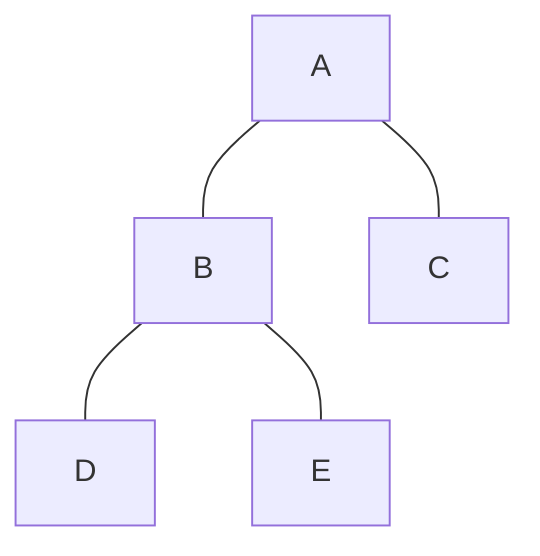

# Trees

A **tree** is a connected, acyclic, undirected graph. The most important special case.



```
V = 5, E = 4
```

---

## The three-way equivalence (memorize this)

For a graph with `V` vertices, **any two** of these three properties imply the third:

1. **Connected**
2. **Acyclic**
3. **Exactly `V - 1` edges**

So all of these are equivalent definitions of a tree:
- connected + acyclic
- connected + exactly `V-1` edges
- acyclic + exactly `V-1` edges

### The fast interview move

"Is this a valid tree?" →

```python
if len(edges) != n - 1:
    return False
# then one BFS/DFS from node 0; return whether it reached all n nodes
```

Two lines, done.

> **Don't check only the edge count.** A triangle plus an isolated vertex has `V-1`
> edges but is neither connected nor acyclic. You need *two* of the three properties.

---

## Other tree facts worth having loaded

- Between any two vertices there is **exactly one** [[05 Paths Walks and Cycles|path]]. Not zero, not two.
- Adding **any** edge to a tree creates **exactly one** cycle.
- Removing **any** edge disconnects it into exactly two pieces. (Every tree edge is a *bridge*.)
- A **leaf** is a vertex of [[08 Degree|degree]] 1. Every tree with ≥ 2 vertices has at least 2 leaves.
- A **forest** is a disjoint collection of trees. For a forest: `E = V - (number of [[07 Connectivity and Components|components]])`.

---

## Rooted vs unrooted

The tree above has no inherent "top". Drawing `A` on top was a choice. A tree becomes
**rooted** when you pick a vertex to be the root, which then defines parent/child
relationships and depth.

Interview problems hand you trees in two very different shapes, and you must recognize which:

```python
# SHAPE 1 — already rooted, as a node object (binary tree problems)
class TreeNode:
    def __init__(self, val=0, left=None, right=None):
        self.val, self.left, self.right = val, left, right

# SHAPE 2 — unrooted, as an edge list (graph problems)
# n = 5, edges = [[0,1],[0,2],[1,3],[1,4]]
# You must build the adjacency list yourself, and it's UNDIRECTED —
# so you track `parent` during traversal to avoid walking back up.
```

### The conversion trick

A classic move is converting shape 1 **into** shape 2: take a binary tree, build an
undirected adjacency list (each node gets edges to its children *and its parent*), then
run BFS.

That's how you answer *"all nodes at distance K from a target node"* — the answer needs
to travel **upward**, which the `left`/`right` pointers alone won't let you do.

---

## Related

- [[07 Connectivity and Components|Connectivity and Components]] — forests are disconnected trees
- [[06 Cyclic vs Acyclic and DAGs|Cyclic vs Acyclic and DAGs]] — trees are the undirected acyclic case
- [[08 Degree|Degree]] — leaf peeling ("minimum height trees") is pure degree bookkeeping
- Tier 8 MST — a *spanning tree* is a tree subgraph touching all `V` vertices

---

⬆️ [[00 Vocabulary Index|Tier 0 - Vocabulary]] · ⬅️ [[09 Self-Loops and Multi-Edges|Self-Loops and Multi-Edges]] · ➡️ [[11 Dense vs Sparse|Dense vs Sparse]]
